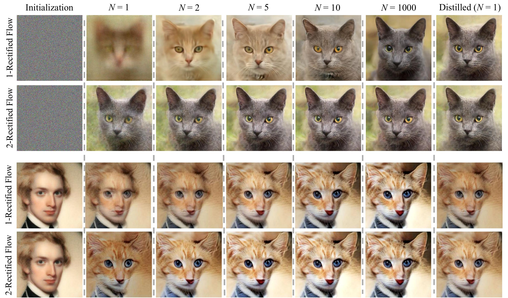
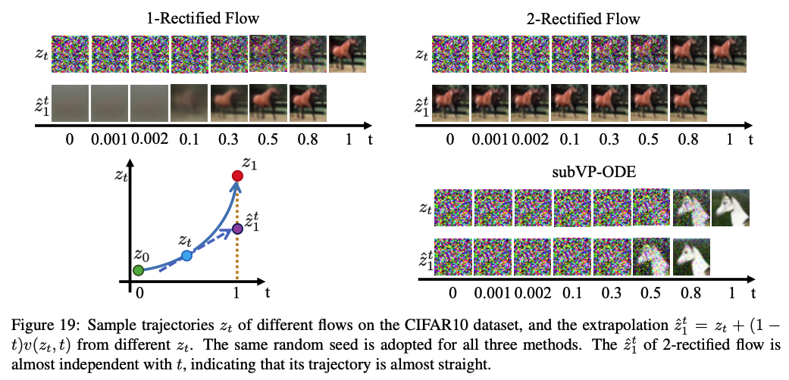

# Rectified Flow

This is the official implementation of paper 
## [Flow Straight and Fast: Learning to Generate and Transfer Data with Rectified Flow](https://arxiv.org/abs/2209.03003) 
by *Xingchao Liu, Chengyue Gong, Qiang Liu* from UT Austin

## Introduction

Rectified Flow is a novel method for learning transport maps between two distributions $\pi_0$ and $\pi_1$, by connecting **straight paths** between the samples and learning an ODE model.

Then, by a **reflow** operation, we iteratively straighten the ODE trajectories to eventually achieve **one-step** generation, with higher diversity than GAN and better FID than fast diffusion models.

An introductory website can be found [here](https://www.cs.utexas.edu/~lqiang/rectflow/html/intro.html) and the main idea is illustrated in the following figure:


Rectified Flow can be applied to both generative modeling and unsupervised domain transfer, as shown in the following figure:



For a more thorough inspection on the theoretical properties and its relationship to optimal transport, please refer to [Rectified Flow: A Marginal Preserving Approach to Optimal Transport](https://arxiv.org/abs/2209.14577)

## Interactive Colab notebooks
We provide interactive tutorials with Colab notebooks to walk you through the whole pipeline of Rectified Flow. We provide two versions with different velocity models, [neural network version](https://colab.research.google.com/drive/1CyUP5xbA3pjH55HDWOA8vRgk2EEyEl_P?usp=sharing) and [non-parametric version](https://colab.research.google.com/drive/1g8Fm_S4BqrDaG2eHI3sDulBD3WbK2D_V?usp=sharing)

## Image Generation

The code for image generation is in ```./ImageGeneration ```. Run the following command first

```
cd ./ImageGeneration
```

### Dependencies
Run the following to install a subset of necessary python packages for our code

```
pip install -r requirements.txt
```

### Train 1-Rectified Flow
Run the following command to train a 1-Rectified Flow from scratch

```
python ./main.py --config ./configs/rectified_flow/cifar10_rf_gaussian_ddpmpp.py --eval_folder eval --mode train --workdir ./logs/1_rectified_flow
```

* ```--config``` The configuration file for this run.

* ```--eval_folder``` The generated images and other files for each evaluation during training will be stroed in ```./workdir/eval_folder```. In this command, it is ```./logs/1_rectified_flow/eval/```

* ```---mode``` Mode selection for ```main.py```. Select from ```train```, ```eval``` and ```reflow```.

### Sampling and Evaluation

We follow the evaluation pipeline as in [Score SDE](https://github.com/yang-song/score_sde_pytorch). You can download [`cifar10_stats.npz`](https://drive.google.com/file/d/14UB27-Spi8VjZYKST3ZcT8YVhAluiFWI/view?usp=sharing) and save it to `assets/stats/`. 
Then run

```
python ./main.py --config ./configs/rectified_flow/cifar10_rf_gaussian_ddpmpp.py --eval_folder eval --mode eval --workdir ./logs/1_rectified_flow --config.eval.enable_sampling  --config.eval.batch_size 1024 --config.eval.num_samples 50000 --config.eval.begin_ckpt 2
```

which uses a batch size of 1024 to sample 50000 images, starting from checkpoint-2.pth, and computes the FID and IS.

### Generate Data Pair $(Z_0, Z_1)$ with 1-Rectified Flow

To prepare data for reflow, run the following command
```
python ./main.py --config ./configs/rectified_flow/cifar10_rf_gaussian_reflow_generate_data.py  --eval_folder eval --mode reflow --workdir ./logs/tmp --config.reflow.last_flow_ckpt "./logs/1_rectified_flow/checkpoints/checkpoint-10.pth" --config.reflow.data_root "./assets/reflow_data/1_rectified_flow/" --config.reflow.total_number_of_samples 100000 --config.seed 0
```

* ```--config.reflow.last_flow_ckpt``` The checkpoint for data generation.

* ```--config.reflow.data_root``` The location where you would like the generated pairs to be saved. The $(Z_0, Z_1)$ pairs will be saved to ```./data_root/seed/```

* ```--config.reflow.total_number_of_samples``` The total number of pairs you would like to generate

* ```--config.seed``` The random seed. Change random seed to perform data generation in parallel.

For CIFAR10, we suggest to generate at least 1M pairs for reflow.

### Reflow to get 2-Rectified Flow with the Generated Data Pair

After the data pairs are generated, run the following command to train 2-rectified flow

```
python ./main.py --config ./configs/rectified_flow/cifar10_rf_gaussian_reflow_train.py  --eval_folder eval --mode reflow --workdir ./logs/2_rectified_flow --config.reflow.last_flow_ckpt "./logs/1_rectified_flow/checkpoints/checkpoint-10.pth" --config.reflow.data_root "./assets/reflow_data/1_rectified_flow/"
```

This command fine-tunes the checkpoint of 1-Rectified Flow with the data pairs generated in the last step, and save the logs of 2-rectified flow to ```./logs/2_rectified_flow```.
2-Rectified Flow should have a much better performance when using one-step generation $z_1=z_0 + v(z_0, 0)$, as shown in the following figure:



To evaluate with step N=1, run
```
python ./main.py --config ./configs/rectified_flow/cifar10_rf_gaussian_ddpmpp.py --eval_folder eval --mode eval --workdir ./logs/2_rectified_flow --config.sampling.use_ode_sampler "euler" --config.sampling.sample_N 1 --config.eval.enable_sampling  --config.eval.batch_size 1024 --config.eval.num_samples 50000 --config.eval.begin_ckpt 2
```
where ```sample_N``` refers to the number of sampling steps.

We can further improve the quality of 2-Rectified Flow in one-step generation with distillation.

### Distill to get one-step 2-Rectified Flow 
Before distillation, we need new data pairs from 2-Rectified Flow. This can be simply done with
```
python ./main.py --config ./configs/rectified_flow/cifar10_rf_gaussian_reflow_generate_data.py  --eval_folder eval --mode reflow --workdir ./logs/tmp --config.reflow.last_flow_ckpt "./logs/2_rectified_flow/checkpoints/checkpoint-10.pth" --config.reflow.data_root "./assets/reflow_data/2_rectified_flow/" --config.reflow.total_number_of_samples 100000 --config.seed 0
```

Then we can distill 2-Rectified Flow with
```
python ./main.py --config ./configs/rectified_flow/cifar10_rf_gaussian_reflow_distill_k=1.py  --eval_folder eval --mode reflow --workdir ./logs/2_rectified_flow_k=1_distill --config.reflow.last_flow_ckpt "./logs/2_rectified_flow/checkpoints/checkpoint-10.pth" --config.reflow.data_root "./assets/reflow_data/2_rectified_flow/"
```

### Distill to get k-step 2-Rectified Flow (k>1)
Similarly, we can distill 2-Rectified Flow for k-step generation (k>1) with
```
python ./main.py --config ./configs/rectified_flow/cifar10_rf_gaussian_reflow_distill_k_g_1.py  --eval_folder eval --mode reflow --config.reflow.reflow_t_schedule 2 --workdir ./logs/2_rectified_flow_k=2_distill --config.reflow.last_flow_ckpt "./logs/2_rectified_flow/checkpoints/checkpoint-10.pth" --config.reflow.data_root "./assets/reflow_data/2_rectified_flow/"
```
Here, we use k=2 as an example. Change ```--config.reflow.reflow_t_schedule``` to accomodate for different k. 

### Pre-trained Checkpoints
Work in progress.

As an example, to use pre-trained checkpoints, download the ```checkpoint_8.pth``` from [CIFAR10 1-Rectified Flow](https://drive.google.com/file/d/10aPF5KC30SjVwr6rOnNosStpSGXnELXn/view?usp=sharing), put it in ```./logs/1_rectified_flow/checkpoints/```, then run

```
python ./main.py --config ./configs/rectified_flow/cifar10_rf_gaussian_ddpmpp.py --eval_folder eval --mode eval --workdir ./logs/1_rectified_flow --config.eval.enable_sampling  --config.eval.batch_size 1024 --config.eval.num_samples 50000 --config.eval.begin_ckpt 8
```


The pre-trained checkpoints are listed here:

* [CIFAR10 1-Rectified Flow](https://drive.google.com/file/d/10aPF5KC30SjVwr6rOnNosStpSGXnELXn/view?usp=sharing)

## Image-to-Image Translation

Work in progress.

## Citation
If you use the code or our work is related to yours, please cite us:
```
@article{liu2022flow,
  title={Flow straight and fast: Learning to generate and transfer data with rectified flow},
  author={Liu, Xingchao and Gong, Chengyue and Liu, Qiang},
  journal={arXiv preprint arXiv:2209.03003},
  year={2022}
}
```

## Thanks
A Large portion of this code base is built upon [Score SDE](https://github.com/yang-song/score_sde_pytorch).
