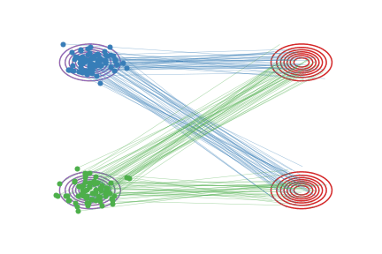
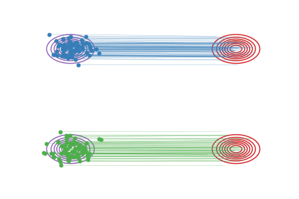

# RectifiedFlow

This is the official implementation of paper 
## [Flow Straight and Fast: Learning to Generate and Transfer Data with Rectified Flow](https://arxiv.org/abs/2209.03003) 
by *Xingchao Liu, Chengyue Gong, Qiang Liu* from UT Austin

||  |   |
|:---:|:---:|:---:|
| (a) Linear Interpolation $X_t$ | (b) Rectified Flow $Z_t$ | (c) Straightened Rectified Flow after Reflow  |

Rectified Flow is a novel method for learning transport maps between two distributions $\pi_0$ and $\pi_1$
